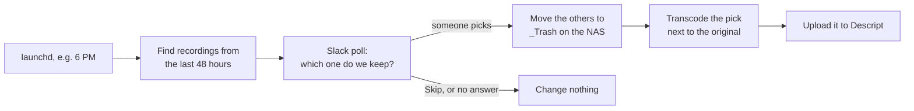

# transcoder-bot

Turns Blackmagic HyperDeck recordings on a NAS into phone-ready vertical video on a Mac. It can also ask your team in Slack which take to keep first.

For each recording it:

1. **Rotates** the picture 90° counter-clockwise.
2. **Normalizes the audio** to −16 LUFS with two-pass EBU R128 loudness normalization.
3. **Downscales** 4K (3840×2160) to 1080p, so the rotated result is 1080×1920.
4. **Saves** it beside the original as `<name>_1080p.mp4` (H.264 + AAC).
5. **Uploads** it to a new Descript project, ready for editing (optional).

With Slack set up, the daily run looks like this:



Without Slack, it transcodes every new recording instead. Uploading to Descript is optional either way.

## Recommendations and how it works

### The ffmpeg pipeline

Each recording gets two ffmpeg passes. The first reads just the audio track and measures its loudness. The second does everything else, using those measurements:

```sh
# Pass 1: measure the loudness (reads only the audio, so it's quick)
ffmpeg -i Service.mov -map 0:a:0 \
  -af 'pan=stereo|c0=c0|c1=c1,loudnorm=I=-16:TP=-1.5:LRA=11:print_format=json' -f null -

# Pass 2: rotate, scale, normalize and encode, with the numbers from pass 1
ffmpeg -i Service.mov -map 0:v:0 -map 0:a:0 \
  -vf 'scale=1920:1080:flags=lanczos,setsar=1,transpose=dir=cclock,format=yuv420p' \
  -c:v libx264 -preset medium -crf 20 -profile:v high \
  -af 'pan=stereo|c0=c0|c1=c1,loudnorm=I=-16:TP=-1.5:LRA=11:measured_I=-27.61:measured_TP=-4.47:measured_LRA=8.06:measured_thresh=-38.20:offset=0.58:linear=true,aresample=48000' \
  -c:a aac -b:a 192k -map_metadata 0 -movflags +faststart Service_1080p.mp4
```

| Step | Choice | Why |
|---|---|---|
| Rotate | `transpose=dir=cclock` | Rotates the pixels themselves. A rotation *flag* would be quicker to write, but some players and upload pipelines ignore it. |
| Scale | Lanczos, before rotating | 3840×2160 → 1920×1080 is a clean 2:1. Scaling first means rotating a 1080p frame rather than a 4K one, which is 4× less work. It never upscales, so a 1080p source is only rotated. |
| Loudness | Two-pass `loudnorm`: −16 LUFS, −1.5 dBTP peak, 11 LU range | −16 LUFS is the usual target for phones, podcasts and social video. YouTube plays back at about −14, so use `target_lufs = -14` if that's your main outlet. Two passes let ffmpeg apply one clean gain change instead of riding the level. |
| Audio channels | Channels 1–2 as left/right | HyperDecks record 2–16 embedded channels, and the program mix is normally on 1 and 2. Change `audio.channels` if yours differs, e.g. `[1]` for a single mic on channel 1. |
| Video | H.264 High, CRF 20, preset `medium` | Plays everywhere. Files are typically a few GB per 45 minutes, depending on the picture. |
| Container | MP4 with `faststart`, AAC 192 kb/s | Ready to upload or stream: playback can start before the whole file has downloaded. |

loudnorm only applies a single gain change when it can do so cleanly. If a recording's loudness range is wider than 11 LU, or a straight gain would push peaks past the limit, it quietly switches to gentle dynamic normalization. Raise `audio.lra` (maximum 50) if you'd rather keep more of the original dynamics.

It also protects the originals and the NAS:

- **The encode is staged locally.** It is written to the Mac's own disk and checked for the right size, length and audio. Only then is it copied beside the original, under a hidden `.partial` name, and renamed. A half-written file never appears on the NAS.
- **In-progress recordings are skipped.** HyperDeck files on shared storage can grow while they're still recording, so files modified in the last 5 minutes are ignored.
- **The Mac stays awake while it works** (via `caffeinate`), and ffmpeg is stopped cleanly if the job is.

### About your recordings

70 GiB per 45 minutes is about 220 Mbit/s. That's a little above 2160p29.97 ProRes 422 Proxy or DNxHR LB with 16 audio channels (around 200 Mbit/s), and almost exactly 1080p29.97 ProRes 422 HQ. ffmpeg decodes all of these. `transcoder-bot scan` prints each file's resolution. If yours turn out to be 1080p, the downscale step is simply skipped.

### Speed

Each transcode reads the whole recording from the NAS. For a 70 GiB file, that alone takes about 11 minutes over gigabit Ethernet, or 1–2 minutes over 10 GbE if the NAS keeps up. The encode usually takes longer than the read. If it's too slow for you:

- `encoder = "h264_videotoolbox"` encodes on Apple's media engine: several times faster, with somewhat larger files at the same quality.
- `hwaccel = "videotoolbox"` also decodes ProRes on the media engine, which leaves the CPU free for the encoder.

## Setup on the Mac Studio

### 1. Install the tools

```sh
brew install ffmpeg uv
```

No Homebrew yet? Install it from [brew.sh](https://brew.sh) first. `uv` installs Python and the project's dependencies for you.

### 2. Get the code

```sh
git clone https://github.com/dawsontoth/transcoder-bot.git ~/transcoder-bot
cd ~/transcoder-bot
uv sync --managed-python
```

`--managed-python` uses uv's own standalone Python instead of Homebrew's, which makes the macOS permission step (9) simpler. Run commands from this folder as `uv run transcoder-bot …`.

### 3. Connect the NAS

1. In Finder, choose **Go → Connect to Server** (⌘K), enter `smb://<your-nas>/<share>`, and tick **Remember this password in my keychain**.
2. Note the folder the HyperDeck records into, e.g. `/Volumes/HyperDeck`.
3. Put the `smb://…` address in the config's `mount_url` (next step). The job can then remount the share if it drops.

### 4. Create the config

```sh
uv run transcoder-bot init-config
open -e ~/.config/transcoder-bot/config.toml
```

Set `recordings_dir` and `mount_url`. Everything else has sensible defaults, each explained in the file. Then check your setup:

```sh
uv run transcoder-bot doctor
uv run transcoder-bot scan
```

### 5. Try one recording by hand

```sh
uv run transcoder-bot transcode --dry-run "/Volumes/HyperDeck/Service.mov"
uv run transcoder-bot transcode "/Volumes/HyperDeck/Service.mov"
```

Open the `_1080p.mp4` it creates and check the orientation and the sound. If it's turned the wrong way, set `rotate = "cw"`.

### 6. Set up the Slack poll (optional)

1. Go to [api.slack.com/apps](https://api.slack.com/apps) → **Create New App** → **From a manifest**. Pick your workspace, and paste in [`slack-app-manifest.yml`](slack-app-manifest.yml).
2. Under **Basic Information → App-Level Tokens**, choose **Generate Token and Scopes**. Name it `socket`, add the `connections:write` scope, and generate it. Copy the `xapp-…` token into `app_token`.
3. Under **Install App**, choose **Install to Workspace**. Copy the **Bot User OAuth Token** (`xoxb-…`) into `bot_token`.
4. In Slack, open the channel for the poll and type `/invite @transcoder-bot`. Click the channel name; the channel ID (like `C0123456789`) is at the bottom of the **About** tab. Copy it into `channel`.
5. Optionally, fill in `allowed_user_ids` so only certain people can pick. To find a member ID, open their profile, then **⋯ → Copy member ID**.
6. Test it:

   ```sh
   uv run transcoder-bot doctor --post-test
   uv run transcoder-bot poll --dry-run --timeout-hours 0.25
   ```

   The dry run posts a real poll, but only reports what it would trash and transcode.

Because the config holds the tokens, `init-config` makes it readable only by you. You can set `SLACK_BOT_TOKEN` and `SLACK_APP_TOKEN` in the environment instead.

The app uses Socket Mode: the Mac opens a connection out to Slack, so it needs no public URL or open port.

### 7. Send videos to Descript (optional)

1. In Descript, open **Settings → API tokens → Create token**. Name it, and pick the Drive the projects should go in.
2. Put the token (`dx_bearer_…:dx_secret_…`) in the config's `[descript]` section as `api_key`. Or set the `DESCRIPT_API_KEY` environment variable instead.
3. Run `uv run transcoder-bot doctor` to check the key works.

From then on, each finished transcode is uploaded to a new Descript project, and the Slack thread gets a link to it. [Sending videos to Descript](#sending-videos-to-descript) has the details.

### 8. Schedule it

```sh
uv run transcoder-bot schedule install --at 18:00
```

This installs a launchd agent (`~/Library/LaunchAgents/local.transcoder-bot.plist`) that runs daily at 6 PM. It runs `poll` if Slack is set up, and `transcode --new` if not. Other options:

- `--days sun,wed`: only run on those days.
- `--run transcode`: transcode every new recording, without Slack.
- `schedule print`: show the agent without installing it.
- `schedule uninstall`: remove it.

Start one run now, while you're at the Mac, and watch the log:

```sh
launchctl kickstart gui/$(id -u)/local.transcoder-bot
tail -f ~/Library/Logs/transcoder-bot.log
```

### 9. Let macOS allow it

A background job needs your permission to use a network volume:

- If macOS asks during the run above whether Python may access files on a network volume, click **Allow**.
- To grant access in advance, or if the log shows `Operation not permitted`, give Full Disk Access to the Python the job runs. Print its path:

  ```sh
  uv run python -c 'import sys, pathlib; print(pathlib.Path(sys.executable).resolve())'
  ```

  Then go to **System Settings → Privacy & Security → Full Disk Access**, click **+**, press ⌘⇧G and paste that path.

The grant belongs to that exact Python binary, so repeat this if uv upgrades Python.

Also:

- The job runs in your login session, so the Mac must be logged in. A locked screen is fine.
- If the Mac is asleep at the scheduled time, the job runs when it wakes. To wake it on time, run `sudo pmset repeat wakeorpoweron MTWRFSU 17:55:00`.

## How the Slack poll works

The poll looks like this:

> **🎬 Which recording should we keep?**
> Found **3 recordings** from the last 48 hours in `/Volumes/HyperDeck`. Pick the one to keep: it'll be rotated 90° counter-clockwise, scaled to 1080p and loudness-normalized, and saved next to the original. The others will be moved to `_Trash` on the NAS (and deleted for good after 7 days).
>
> **Service_0930.mov** — finished Yesterday at 10:18 AM · 45m 12s · 70.1 GiB  `Keep this one`
> **Service_1100.mov** — finished Yesterday at 11:49 AM · 44m 01s · 68.2 GiB  `Keep this one`
> **Rehearsal.mov** — finished Yesterday at 8:02 AM · 12m 40s · 19.6 GiB  `Keep this one`
> `Skip, change nothing`
> *Closes Tomorrow at 6:00 AM. If nobody picks by then, nothing is deleted.*

**Picking.** Clicking **Keep this one** asks for confirmation, and the first confirmed pick wins. Anyone who clicks after that is told privately that the poll has closed.

**Trashing.** The unpicked recordings move to `_Trash/<date>/` inside the recordings folder.

- Because the trash is on the same share, this is an instant rename, even for 70 GiB files.
- To undo it, move a file back.
- After `retention_days` (7 by default), the daily run deletes them for good.
- Set `trash.mode = "delete"` to skip the trash folder and delete right away.

**Transcoding.** Then the pick is transcoded. Progress appears in a thread under the poll, and the poll message ends with ✅ or ❌.

**Skipping or no answer.** **Skip, change nothing** leaves every file alone. So does getting no answer within `poll_timeout_hours` (12 by default). Unpicked recordings come up again in the next poll for as long as they're under 48 hours old.

**What's listed.** The poll lists up to 15 recordings. Each must be:

- from the last 48 hours,
- not already transcoded, and
- not modified in the last 5 minutes.

**When clicks count.** Clicks only register while the job is running. If Slack says the app didn't respond, the poll had already timed out or the job was stopped. The next run marks any poll that a crash left open as interrupted.

## Sending videos to Descript

Descript's API is in beta. [Descript's API docs](https://docs.descriptapi.com/) cover which plans include it and how usage counts.

After each transcode, transcoder-bot:

1. **Creates a Descript project.** It's named like `2026-09-26 Service_0930` (set by `project_name`: `{date}` is the recording date, `{stem}` its file name). The project has the 1080p video on its timeline.
2. **Uploads the full-quality video** straight to Descript's storage. The Mac needs no public URL.
3. **Waits for Descript to finish importing it**, for up to `wait_minutes` (60 by default).
4. **Shares the link.** With Slack set up, the link goes in the poll's thread and "Open in Descript" is added to the poll message. Otherwise it's written to the log.

**File size.** Descript's import docs don't list a size limit for API uploads. The 1080p files are typically a few GB, well under what Descript accepts in the browser. If your plan ever rejects big files, set `max_upload_gb`. Videos bigger than that then get a smaller H.264 copy made just for Descript, at the highest bitrate that fits; the file on the NAS stays full quality.

**If an upload fails**, the transcode is kept. The error and a retry command go to the Slack thread and the log:

```sh
uv run transcoder-bot descript-upload "/Volumes/HyperDeck/Service_0930_1080p.mp4"
```

- `descript-upload` works with any video. Add `--name` to choose the project name.
- Add `--no-descript` to `transcode` or `poll` to skip uploading for one run.

Descript also has an official CLI for one-off imports: `npm i -g @descript/platform-cli` (needs Node 24+), then `descript-api import --name "My Project" --media ./video.mp4`. transcoder-bot calls the same API directly, so it doesn't need Node.

## Commands

| Command | What it does |
|---|---|
| `transcoder-bot init-config` | Writes a starter config to `~/.config/transcoder-bot/config.toml`. |
| `transcoder-bot doctor [--post-test]` | Checks ffmpeg, the folders, free space, Slack and Descript. |
| `transcoder-bot scan` | Lists recent recordings with their length and resolution. |
| `transcoder-bot transcode FILE… [--force] [--dry-run]` | Transcodes the given files. |
| `transcoder-bot transcode --new` | Transcodes every recent recording that isn't done yet. |
| `transcoder-bot poll [--dry-run] [--timeout-hours H]` | The Slack poll, then trashing the others and transcoding the pick. |
| `transcoder-bot descript-upload FILE… [--name NAME]` | Uploads videos to new Descript projects, e.g. to retry a failed upload. |
| `transcoder-bot purge-trash [--dry-run]` | Deletes trash folders older than `retention_days`. `poll` does this too. |
| `transcoder-bot schedule install\|uninstall\|print` | Manages the launchd agent. |

Every command accepts `--config PATH`, and `-v` for debug logging. `transcode` and `poll` also take `--no-descript`.

## Configuration

Every option is documented in [`config.example.toml`](src/transcoder_bot/config.example.toml). Common tweaks:

| To… | Set |
|---|---|
| Rotate the other way | `[video] rotate = "cw"` |
| Encode faster | `[video] encoder = "h264_videotoolbox"` and `hwaccel = "videotoolbox"` |
| Make smaller files | `[video] crf = 23` |
| Match YouTube's loudness | `[audio] target_lufs = -14` |
| Use a single mic on channel 1 | `[audio] channels = [1]` |
| Use program audio on channels 3–4 | `[audio] channels = [3, 4]` |
| Look further back | `[scan] lookback_hours = 72` |
| Delete unpicked takes right away | `[trash] mode = "delete"` |
| Put the Descript projects in a folder | `[descript] folder = "HyperDeck"` |
| Let your team edit the Descript projects | `[descript] team_access = "edit"` |

## Troubleshooting

- **`Operation not permitted`.** macOS privacy settings are blocking access to the NAS; see step 9.
- **`Recordings folder … not found. Is the NAS mounted?`** Mount the share in Finder, or set `mount_url`.
  - If Finder mounted it as `/Volumes/HyperDeck-1`, macOS left an empty `/Volumes/HyperDeck` folder behind. Eject the share and reconnect; restart if the folder is still there.
- **`Mounting … timed out`.** macOS is waiting at a login dialog because no password is saved. Connect once in Finder with **Remember this password** ticked.
- **Silent or one-sided audio.** The program audio isn't on channels 1–2.
  - Run `ffprobe your-file.mov` to see how the channels are laid out, then set `audio.channels`.
  - Add `mono = true` if you want the selected channels mixed together.
- **Slack `not_in_channel`.** Type `/invite @transcoder-bot` in the channel.
- **Slack `channel_not_found`.** `channel` must be the channel ID, not its name.
- **Slack says "This app is not responding" when you click.** The job isn't running. The poll may have timed out, or the Mac slept or restarted. The next scheduled run posts a fresh poll.
- **Descript "rejected the API key".** Create a new token under **Settings → API tokens** and update `descript.api_key`. Each token belongs to one Drive.
- **Descript returns HTTP 402 ("payment required").** The Drive may have run out of credits for your plan; check its usage in Descript.
- **"too long to fit under descript.max_upload_gb".** This only happens if you've set `max_upload_gb`: the recording would look too rough squeezed to that size. Raise the limit, or import the `_1080p.mp4` with the Descript app.
- **`encoder libx264 … not available`.** Homebrew has said it may drop x264 from its `ffmpeg` formula in 2027. Either:
  - set `encoder = "h264_videotoolbox"`, or
  - `brew install ffmpeg-full`, then point `ffmpeg` and `ffprobe` at `/opt/homebrew/opt/ffmpeg-full/bin/`.
- **Anything else.** Check `~/Library/Logs/transcoder-bot.log`, or run the command with `-v`.

## Known limitations

- **One file is one recording.** If a HyperDeck ever splits a very long take into several files, each file is listed, and transcoded, separately.
- **One run at a time.** A manual `poll` or `transcode --new` refuses to start while another run is in progress.

## Development

```sh
make install    # uv sync
make check      # lint, type-check and test (what CI runs)
make format     # auto-format and apply safe lint fixes
make test-unit  # skip the ffmpeg integration tests
```

Tooling:

- **Python and packaging:** Python 3.11+ (3.13 pinned in `.python-version`), managed with uv.
- **Linting and formatting:** Ruff.
- **Type checking:** mypy in strict mode.
- **Tests:** pytest.
  - `tests/test_integration.py` runs the real ffmpeg. It transcodes a generated ProRes clip, checks pixels to prove the rotation goes counter-clockwise, and measures the output's loudness.
  - Those tests are skipped when ffmpeg isn't installed.
- **CI:** GitHub Actions runs the same checks on Ubuntu, with ffmpeg installed.

```
src/transcoder_bot/
  cli.py              command-line entry point
  config.py           config loading and validation (see config.example.toml)
  recordings.py       finding recent recordings
  media.py            ffprobe wrapper
  commands.py         ffmpeg filter and argument builders (pure functions)
  loudnorm.py         two-pass loudness normalization helpers
  runner.py           running ffmpeg with progress reporting
  transcode.py        probe → measure → encode → verify → publish
  trash.py            the trash folder and purging it
  slack_messages.py   Slack Block Kit messages and click parsing (pure functions)
  slack_bot.py        Slack Web API and Socket Mode
  poll.py             the poll → trash → transcode → Descript flow
  descript.py         uploading to Descript (API client, smaller copies)
  state.py            the run lock and open-poll bookkeeping
  schedule.py         the launchd agent
  macos.py            caffeinate and mounting the share
  doctor.py           setup checks
```
